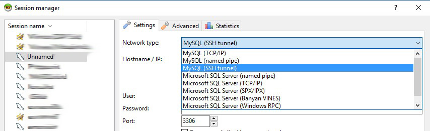
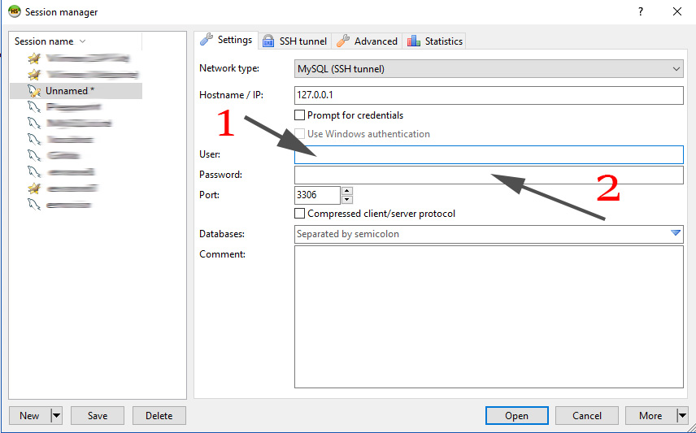
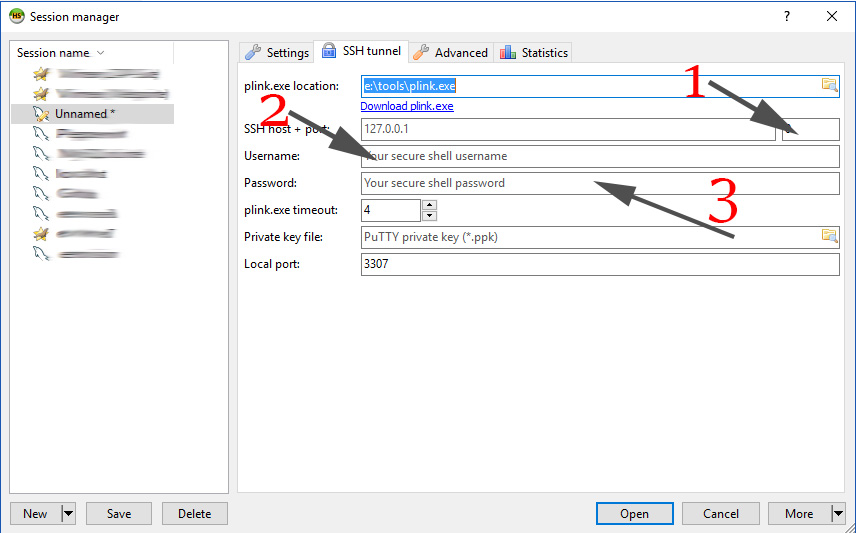
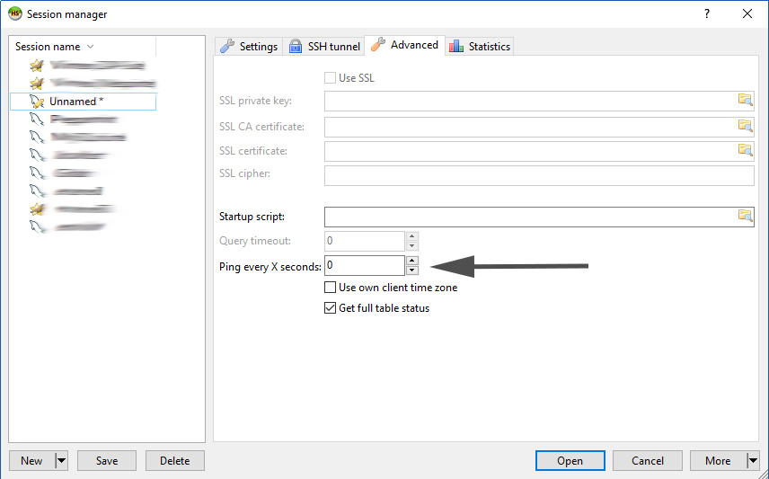

# HeidiSql

## Import Sql

File -> Run SQL File

## Connect to Remote Database via SSH

### Step 1. Create a new connection in HeidiSQL

First thing you have to do is to create a new session in the session manager that can be accessed from the "File" menu.

Now dropdown the network type and select "MySQL (SSH Tunnel)".

### Step 2. Modify the settings in the Settings tab

Now fill the following details:

1. Enter here the user ID that your use to connect to your remote MySQL server database.
2. Enter here the password that corresponds with that same user.

This section is about connecting to the database, while the SSH tunnel tab is about connecting to your admin.

### Step 3. Modify the settings in the SSH tunnel tab

HeidiSQL requires plink, a small program to make the connection with the SSH tunnel. It is from the maker of Putty. If you don't have it installed, just click on the "Download plink.exe" link and download the program for your environment (Linux/Windows, 32bits/64bits). The program is only 550Kb and it is best to put is somewhere where you can easily find it, like in c:\tools or something other short. You enter the plink.exe with location in the plink.exe location field.

Now fill the following details as well:

1. The port that you have received from your provider to have access over the SSH tunnel. This could be something a value like 7685, but it depends on your provider.
2. The user id you received from your provider to connect to your hosting backend/admin. This is mostly the user that came with the installation letter. I think you get lucky with the credentials to access Direct Admin or any other admin panel of your provider.
3. Here you put the password of that same user.{.list-style}

This has nothing to do with the database itself. It is about connecting to your hosting admin through SSH.

### Step 4. Modify the settings in the Advanced tab

#### An experience related remark

I've noticed that sometimes the connection gets lost with the server. Therefor it is wise to set the "Ping every X seconds" to a value of 15 (seconds). Modify this to a value that best fit your situation.

### Step 5. Get connected

Finally save your just created session and if everything turns out well you won't need PHPMyAdmin anymore and use all the convenience that comes with HeidiSQL.

[How to connect to a MySQL database over a SSH tunnel with HeidiSQL](https://www.enovision.net/mysql-ssh-tunnel-heidisql/)