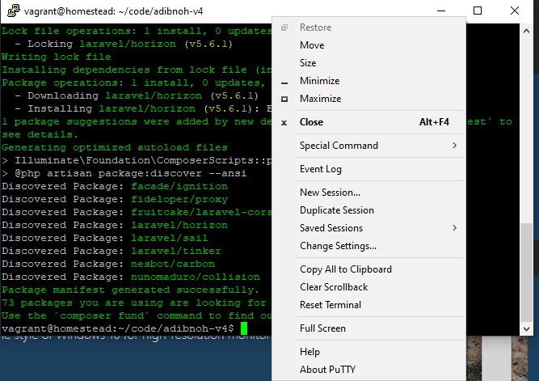

# Database

connect to database

1. SSH to homestead via putty
2. open tunnel
3. Connect do Database via HeidiSql

## SSH to homestead via putty


we can ssh to homestead via putty with default config:

```
username: vagrant
host: 192.168.10.10
password: vagrant
```

## Open tunnel



While your terminal is open, you may right click terminal top bar and choose `Change Settings...`


Inside putty settings, navigate to Connection -> SSH Tunnels

Fill up Source Port with `3306` and Destionation with `127.0.0.1:3306` and click button `Add` and click button `Apply`

## Connect to database via HeidiSql


Open HeidiSql, and fill up all neccessary field and click button `open`

```
Network Type: Mysql (TCP/IP)
Libary: libmariadb.dll
Hostname/IP: 127.0.0.1
User: homestead
Password: secret
Port: 3306
```

## Reference

[Homestead VM tutorial - Access Homestead database from heidisql interface](https://www.youtube.com/watch?v=sSIETAHuqlQ)